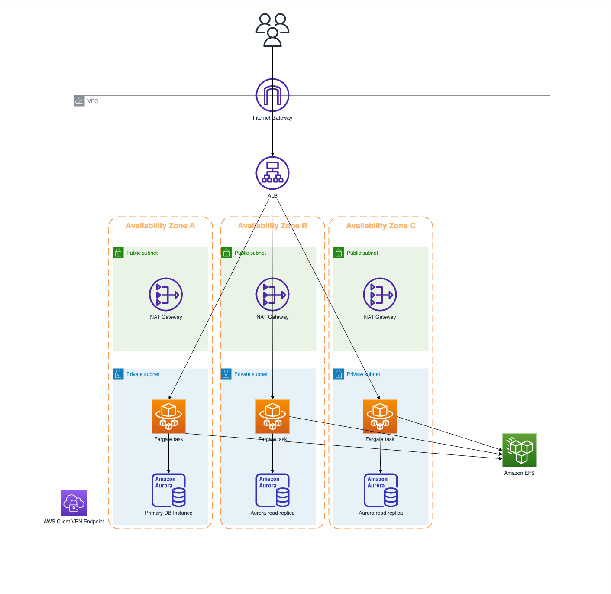

# stormit-devops
[](https://opensource.org/licenses/MIT)

StormIT Devops Role Technical Assessment.


#### AWS Infrastructure Diagram



### Project Task
Use Terraform, an Infrastructure as Code (IaC) Tool to provision the AWS Services shown in the infrastructure diagram.

### AWS Services provision
* AWS S3 Bucket
* AWS DynamoDB
* VPC 
* Subnets
* Internet Gateway
* Nat Gateway
* Route Table
* Application Load Balancer
* AWS EKS Cluster with Fargate Profile
* Wordpress Application 
* AWS Aurora
* Amazon EFS
* AWS Client VPN

These services were deployed to eu-central-1 Frankfurt Region and they spans three Availability Zones, making it highly available.

### Aurora Multi-AZ RDS DB Cluster
Deployed as Multi-AZ. A Multi-AZ DB cluster deployment is a high availability deployment mode of Amazon RDS with two readable standby DB instances. A Multi-AZ DB cluster has a writer DB instance and two reader DB instances in three separate Availability Zones in the same AWS Region.

### How to Provision the AWS Services

#### Configure AWS S3 bucket as Terraform backend
1. Create an S3 Bucket
2. Modify S3 bucket policy by adding the following bucket policy:
   ```
     {
      "Version": "2012-10-17",
      "Statement": [
         {
            "Effect": "Allow",
            "Principal": {
               "AWS": "<your_user_arn>"
            },
            "Action": "s3:ListBucket",
            "Resource": "<your_bucket_arn>"
         },
         {
            "Effect": "Allow",
            "Principal": {
               "AWS": "<your_user_arn>"
            },
            "Action": [
               "s3:GetObject",
               "s3:PutObject"
            ],
            "Resource": "<your_bucket_arn>/*"
         }
      ]
   }
   ```

3.  Create DynamoDB table for Terraform State locking purpose
4.  Configure Terraform to point to this backend
    *  Access the provider.tf file and replace the values.
  
  
    ```
    terraform {
      backend "s3" {
         bucket         = "<your_bucket_name>"
         key            = "terraform.tfstate"
         region         = "<your_aws_region>"
         dynamodb_table = "<your_dynamo_dbtable_name>"
      }
    }
    ```
   
#### Steps to Create the AWS Services
1. To initializes Terraform and download the required providers and pluging, from your terminal run:
   ```
   terraform init
   ```
2. To have a look at the AWS resource Terraform will provision, run:
   ```
   terraform plan
   ```
3. After review the output of `terraform plan` and everything look good. Provision the resources by running:
   ```
   terraform apply
   ```

### Possible Improvements
* Re-structure the repository so we can use same Terraform code with different variable files for multi-environment setup.
* Use Terraform Modules for Code Management.
* Use Yaml manifest and Helm in place of Terraform to package and deploy the Wordpress application.


### License

[MIT](https://opensource.org/licenses/MIT)

### Author

[Russell Nyorere](https://neorusse.github.io/)